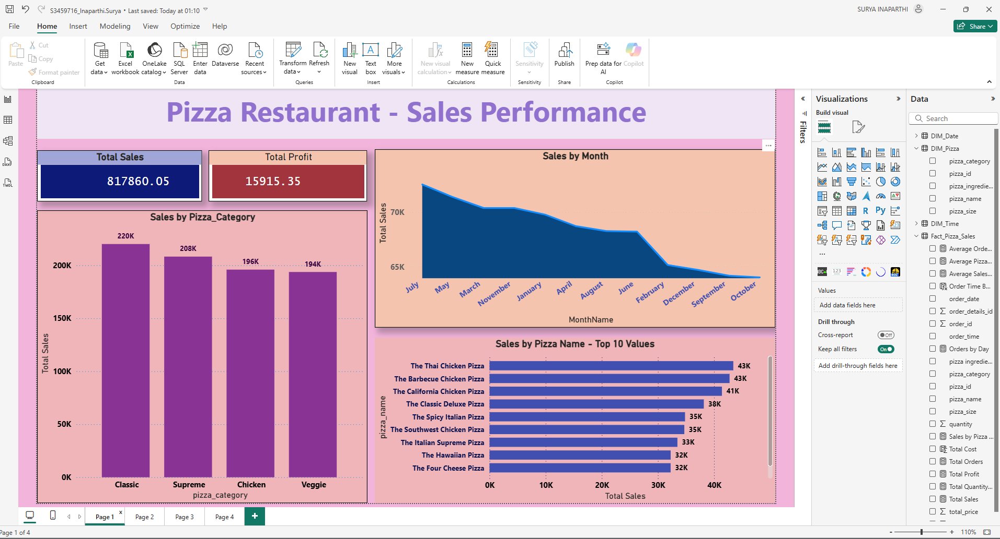
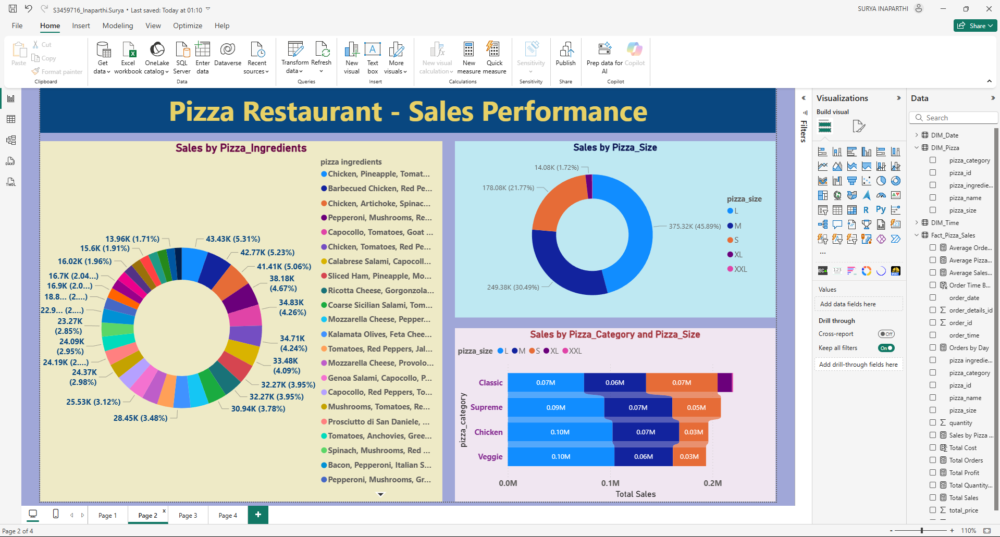
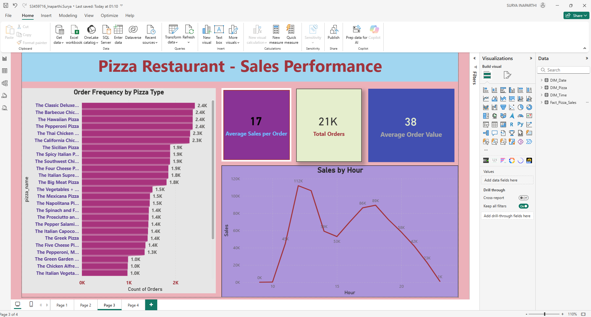
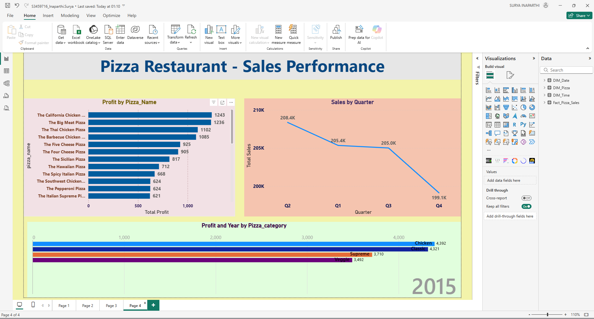

# 🍕 Pizza Restaurant Sales Dashboard (Power BI)

## 📌 Project Overview
This project delivers an interactive **Power BI dashboard** analyzing sales performance,
customer purchasing behavior, and product profitability for a pizza restaurant.
The dashboard enables data-driven decision-making for revenue growth and cost optimization.

---

## 🎯 Business Objectives
- Analyze total sales and profit trends
- Identify best and worst performing pizza categories
- Understand customer order behavior and peak times
- Evaluate product profitability and pricing opportunities

---

## 🛠 Tools & Technologies
- Power BI
- DAX (Advanced Measures)
- Data Modeling (Star Schema)
- Excel / CSV
- Data Cleaning & Transformation

---

## 📊 Key KPIs
- Total Sales
- Total Profit
- Average Order Value
- Total Orders
- Sales Growth
- Profit by Pizza Category

---

## 🧠 Key Insights
- Classic pizzas generated the highest sales volume
- Large-sized pizzas contributed nearly 50% of revenue
- Peak ordering hours: **12–1 PM** and **5–6 PM**
- California Chicken and Big Meat pizzas were most profitable
- Profit margins revealed optimization opportunities in pricing

---

## 📷 Dashboard Preview

### Sales & Profit Overview

### Ingredient & Size Impact

### Customer Behavior

### Profitability Trends

---

## 📁 Repository Structure
